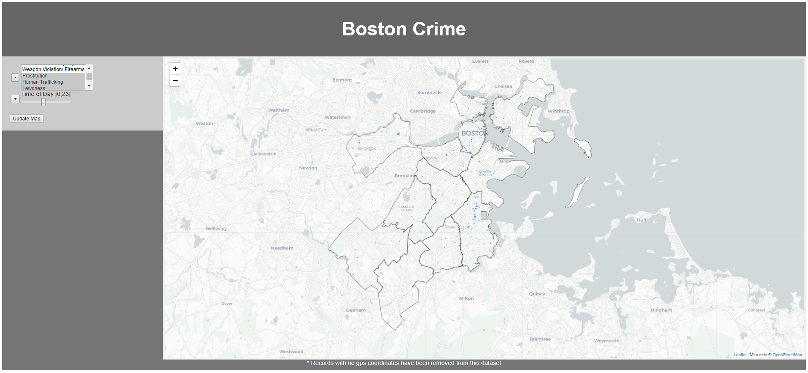

# BostonCrime_Visualization
Visualization using OpenStreetMap, Leaflet, and D3 to show crime distribution throughout Boston Massachusetts.

## View Here
<a href='https://joelstansbury.github.io/BostonCrime_Visualization/'>https://joelstansbury.github.io/BostonCrime_Visualization/</a>

## Usage Example
If you want to view only Traffic Violations you would...
* Press the `-` button next to the `Time of Day` slider. This removes the TOD filter, allowing incidents from all hours of the day to be displayed
* Press the `+` button to the left of `Crime Categories` to enable the category filter.
* Scroll down the list until you find `Traffic Violation` and Left Click. It will highlight when selected
* Press the `Update Map` button and wait a few seconds for all of the markers to be drawn



## Other Interesting Searches
* Prostitution
* Alcohol
* Riot/Party/Strike
* Assault @ 2am

You can also select multiple crime categories to be displayed by holding `ctrl` or `shift`. ~~This may cause the browser to timeout~~ **Fix discussed below**


## RECENT CHANGES
Optimized search function with a hashmap. 

using a list --> O(n*m).
```
# SUDO CODE FOR SEARCHING ALGORITHM
# The total number of crime codes is 576
#   These are distributed across all of the categories 
#   shown in the webpage (Assault, Murder,...)

for crime in crimes:           # ~282,000 crimes in total
  for cat in crime_categories:   # for each category selected
    if crime.code in cat.codes:  # check if this crime is in the list of codes for that category O(m)
      add_to_map(crime)
```
With a hashmap this is reduced to O(n+m)
```
# SUDO CODE FOR SEARCHING ALGORITHM (HASHMAP)

d = {}
for c in crime_categories:     # for each category selected
  codes = c.codes
  for code in codes:
    d[code]=0

for crime in crimes:           # ~282,000 crimes in total
    if crime.code in d.keys():    # check if this crime is in the dict O(1)
      add_to_map(crime)
```

Further optimization may be done by converting the crime data from an array of datapoints to a hashmap, where the keys are the 576 crime codes, and the values are arrays of crime instances which have the respective codes.


### Disclaimer
These categories were made by me in order to simplify the searching process. There may be mistakes, and some groupings admitedly don't make much sense Riot/Party/Strike for example, the reason for this particular grouping was that these are _groups_ of offenders as opposed to a single offender. The point is, don't take them too seriously, the alternative is selecting individual crime_codes from a list of 576.


