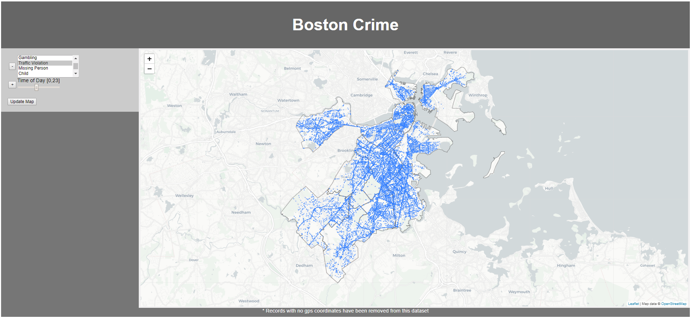

# BostonCrime_Visualization
Visualization using OpenStreetMap, Leaflet, and D3 to show crime distribution throughout Boston Massachusetts.

## View Here
<a href='https://joelstansbury.github.io/BostonCrime_Visualization/'>https://joelstansbury.github.io/BostonCrime_Visualization/</a>

Work is now shifting towards the _real_ user interface.

